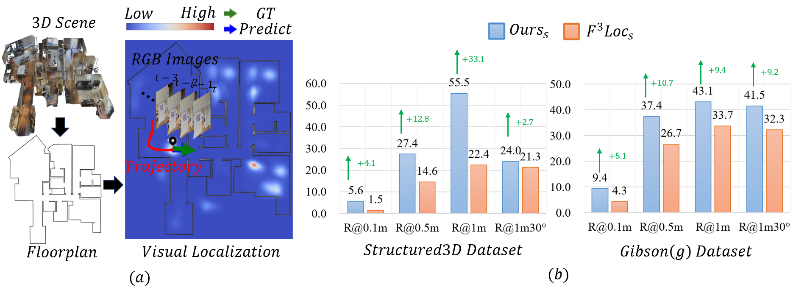
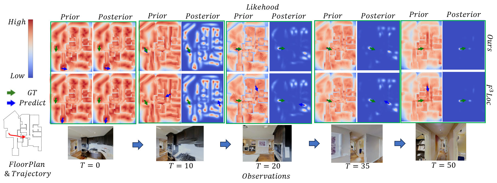

# FLoc
<div align= "left">
    <h1> Code for the paper entitled "Perspective from a Higher Dimension: Can 3D Geometric Priors Help Visual Floorplan Localization?"
    </h1>
</div>




## Requirements
To get started with the code, clone this repository and install the required dependencies:
```bash
git clone https://github.com/BoLeiChen/FLoc
cd FLoc
conda env create -f environment.yml
conda activate floc
```

## Download Checkpoints
Coming Soon...

## Download Dataset
You can download the Gibson dataset from [here](https://github.com/felix-ch/f3loc?tab=readme-ov-file#download-checkpoints).\
The released Gibson Floorplan Localization Dataset contains three datasets <b>gibson_f</b>, <b>gibson_g</b> (four views of forward and geneneral motions) and <b>gibson_t</b> (long trajectories) as described in the paper.\
The data is collected in [Gibson Environment](https://github.com/StanfordVL/GibsonEnv).

Place dataset under the data folder:
```
├── f3loc
│   ├── data
│       ├── Gibson Floorplan Localization Dataset
│           ├── README.md
│           ├── gibson_f
│               ├── ...
│           ├── gibson_g
│               ├── ...
│           ├── gibson_t
│               ├── ...
│           ├── desdf
│               ├── ...
```
For the Structured3D dataset, please see the README in the s3d and s3d/process folders.

## Usage
### Evaluate the observation models
```
python eval_observation_xxx.py --net_type <net-type> --dataset <dataset>
```
Specify the network type, and choose a dataset to evaluate on, you can use gibson_f, gibson_g, or Structured3D, e.g.,
```
python eval_observation_gibson.py --net_type d --dataset gibson_f
```
```
python eval_observation_s3d.py --net_type d --dataset Structured3D
```

### Evaluate the sequential filtering
```
python eval_filtering.py --net_type <net-type> --traj_len <traj-len> --evol_path <evol-dir>
```
This evaluates the sequential filtering with the proposed histogram filter on gibson_t. Choose a network type and specify the trajectory length. Set --evol_dir to a directory if you wish to dump the figures of likelihood and posterior evolution. By default the figures are not saved. E.g.,
```
python eval_filtering.py --net_type comp --traj_len 100 --evol_path ./visualization
```

### Training
```
python train_xxx.py --net_type <net-type> --dataset <dataset>
```

Specify the network type, and choose a dataset to train on, you can use gibson_f, gibson_g, or Structured3D, e.g.,
```
python train_gibson.py --net_type d --dataset gibson_f
```

```
python train_s3d.py --net_type d --dataset Structured3D
```
## Acknowledgments
This repository is implemented based on [F3Loc](https://github.com/felix-ch/f3loc).

## Lincense
This project is licensed under the MIT License.
